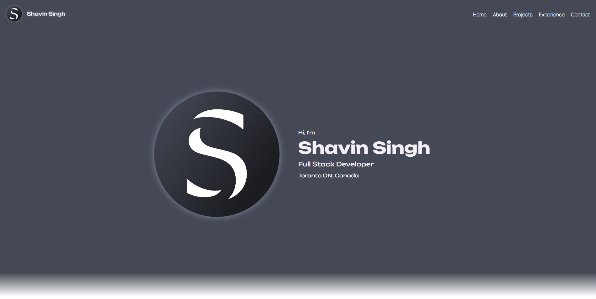

# My Portfolio Site 



Portfolio website built using ReactJS, with a PHP Laravel Backend. 

## Live site

NOTE: Currently, there is an issue with CORS on the console site. please go to [the Console Site](https://console.shavinsingh.tech/) and accept the Certificate.

You can find the site hosted at [https://portfolio.shavinsingh.tech/](https://portfolio.shavinsingh.tech/)

## Running Locally

To run locally, clone the repo to your computer you will need to have Node and NPM installed.

Move into the console and run

```
npm install
```

Once it is complete, run 

```
npm run dev
```

The server will start locally at `http://localhost:5173/`